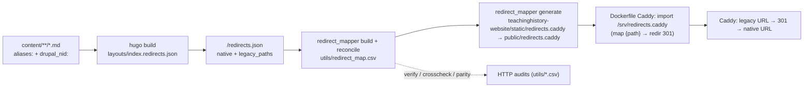

# Legacy URL Redirects (Drupal → Hugo → Caddy)

How teachinghistory.org's old Drupal URLs keep working after the Hugo migration.

- **Old site:** teachinghistory.org (still live on Drupal 10)
- **New site:** dev.teachinghistory.org (this Hugo repo, fronted by Caddy)

**Goal:** Hugo serves clean, native slug URLs; the **web server (Caddy) owns every 301
redirect** from an old Drupal URL to its new native URL. The redirect map is generated
**deterministically from the Hugo content itself** — no MySQL dump, PHP, or other LAMP
artifacts — and the pipeline is CMS-agnostic so it can be reused for other
Omeka/Drupal/WordPress → Hugo migrations.

---

## 1. The core idea: redirects are *derived*, not hand-maintained

There is **no hand-edited redirect list**. Every old→new mapping is computed from the
surviving page's own frontmatter (`aliases:` + `drupal_nid:`), flowing through this chain:



**Source of truth = each page's frontmatter.** The single most important consequence:
when a page is merged, moved, or deleted, its old URLs only keep redirecting if they are
carried onto the surviving page (see §6).

---

## 2. Content model

- **`url:` → `aliases:` (data only).** The legacy Drupal path lives in `aliases:`; it is
  *not* used to serve the page. `disableAliases = true` (in `hugo.toml`) means Hugo writes
  **no** alias stub HTML — Caddy is the sole redirect authority.
- **Native URLs are clean slugs.** Content files are named `{slug}.md` (the `-{drupal_nid}`
  suffix is stripped), so `/history-content/website-reviews/statistics-in-schools/`, not
  `.../statistics-in-schools-25863/`.
- **`drupal_nid:` always stays** in frontmatter — for provenance and to synthesize the
  `/node/{nid}` redirect. Every page's legacy URL set = its `aliases:` (path-aliases) **plus**
  the synthesized `/node/{drupal_nid}` (Drupal serves both; e.g. `/node/24438` 301s to its
  alias on the live site).
- **Slug collisions** keep the `-{nid}` suffix (Hugo's native filename-based
  disambiguation). After the Beyond-the-Textbook merge and distinct-slug renames (§6),
  effectively **no** nid-suffixed URLs remain; the collision safety-net in
  `strip_nid_slugs.py` only re-engages if future content collides.

---

## 3. The tools (`utils/`, run with `uv`)

| Script | Purpose | Idempotent? |
|---|---|---|
| `relocate_urls.py` | `url:` → `aliases:` across all content | yes |
| `strip_nid_slugs.py` | drop `-{nid}` from filenames; keep on genuine collisions | yes |
| `finalize_btt_merge.py` | retire Beyond-the-Textbook Part-1 drafts, moving their redirects to the merged page | yes |
| `redirect_mapper.py` | `build` · `reconcile` · `generate` · `verify` · `crosscheck` · `parity` · `crawl` | n/a |
| `layouts/index.redirects.json` | Hugo template that emits `/redirects.json` (the manifest) | n/a |

Each script has a full docstring; run with `--help` (argparse) where applicable. All the
one-time content transforms default to a **dry run** and take `--apply`.

---

## 4. Running the pipeline (runbook)

```bash
# One-time content transforms (dry-run first without --apply)
uv run utils/relocate_urls.py --apply         # url: -> aliases:
uv run utils/strip_nid_slugs.py --apply       # drop -{nid} from filenames
uv run utils/finalize_btt_merge.py --apply    # retire BTT Part-1 drafts, keep their redirects

# Generate the map + Caddy snippet
just build                                    # Hugo emits public/redirects.json
uv run utils/redirect_mapper.py build         # manifest -> utils/redirect_map.csv
uv run utils/redirect_mapper.py reconcile     # merge old_urls.csv (if any) + parent-section fallback
uv run utils/redirect_mapper.py generate      # -> teachinghistory-website/static/redirects.caddy (Hugo copies to public/)

# Verify / audit (see §5)
uv run utils/redirect_mapper.py verify   --target http://localhost:8080
uv run utils/redirect_mapper.py parity   --old-site https://teachinghistory.org --target http://localhost:8080
```

Discoverable via `just` too: `just redirects` (= build + reconcile + generate), plus
`just redirects-verify`, `just redirects-crosscheck`, `just redirects-relocate`.

---

## 5. Verification & auditing

Three independent HTTP checks (all deterministic, `--resume`/`--limit` supported; reports
land in `utils/*.csv`, gitignored):

- **`verify --target <caddy>`** — for each redirect: old path returns **301** with
  `Location` = expected native, and the native returns **200**; flags loops.
  *Last full run: 4,485/4,485 redirects → correct native 301; 2,230/2,230 targets → 200.*
- **`crosscheck --old-site <drupal>`** — QA oracle: for each `nid`, the live Drupal
  `/node/{nid}` 301s to the alias we recorded. Confirms the map matches the live source.
- **`parity --old-site <drupal> --target <caddy>`** — for each redirect, confirms the
  legacy URL still resolves (200) on the **live old site** *and* its target resolves (200)
  on the **new site**. Verdicts: `ok` / `old_missing` / `new_missing` / `both_missing`.
  *Last full run: 4,482 ok, 0 broken targets, 3 `old_missing` (see §8).*

---

## 6. Preserving redirects when pages merge / move

Because redirects are derived from the surviving page's frontmatter, a merge/move only
keeps its redirects if the retired page's old URLs are copied onto the survivor — **both**
its path-alias(es) **and** `/node/{its_nid}` — otherwise those URLs 404.

`finalize_btt_merge.py` implements this for the **Beyond-the-Textbook** section. BTT content
is authored as two nodes per topic — Part 1 (`beyond_the_textbook`, a short "What Textbooks
Say" intro) and Part 2 (`beyond_the_textbook_part_2`, the long historian essay). The merge
folds Part 1's content into Part 2 and marks Part 1 a draft; but a draft is excluded from the
build, so its old URLs would drop out of the manifest. The finalize step, per topic:

1. copies Part 1's `aliases:` **and** `/node/{part1_nid}` onto the (surviving) Part 2 page;
2. renames Part 2 to the clean slug;
3. deletes the Part 1 draft.

Result: both nids' old URLs 301 to the single merged page (e.g. `/…/23918`, `/…/23919`,
`/node/23918`, `/node/23919` → `/history-content/beyond-the-textbook/huey-long/`).

**The same principle applies to any future merge/move** — move the old URLs onto the
survivor's `aliases:`, then regenerate.

---

## 7. Caddy integration

`redirects.caddy` is a **snippet** (directives, not a full server), imported **inside a site
block**. It is generated into `teachinghistory-website/static/`, so Hugo publishes it to
`public/redirects.caddy` — that is what ships it in the build/release artifact, and it lands
at `/srv/redirects.caddy` in the container. In this repo the wiring is baked into
`teachinghistory-website/Dockerfile`:

```caddy
:80 {
	root * /srv
	encode gzip zstd
	import /srv/redirects.caddy          # map {path} {redirect_target} + redir 301
	rewrite /img/* /assets{uri}
	file_server
}
```

One side effect of shipping it inside `public/`: the snippet is also fetchable at
`/redirects.caddy`. That's harmless (it's derived from public URLs); add a matcher to 404 it
if you'd rather not serve it.

Generated snippet shape:

```caddy
map {path} {redirect_target} {
	default ""
	/node/24438  /teaching-materials/english-language-learners/summarizing-and-paraphrasing/
	/node/24438/ /teaching-materials/english-language-learners/summarizing-and-paraphrasing/
	# … one line per legacy key …
}
@hasRedirect expression `{redirect_target} != ""`
redir @hasRedirect {redirect_target} 301
```

Details the generator handles:
- **Directive order:** Caddy runs `map` early and `redir` before `rewrite`/`file_server`,
  so a matched legacy path 301s before `file_server` can 404.
- **Trailing slash:** both `/x` and `/x/` are emitted so either form redirects. (Native
  URLs' trailing-slash canonicalization is handled automatically by `file_server` — a 308 —
  and is *not* part of the map.)
- **Loop guard:** any key equal to its own target is dropped (e.g. `/about/staff/`).
- **Conflicts:** if two pages claim one old URL, the winner is chosen deterministically
  (matched > fallback, then fewer path segments, then lexicographic) and logged.

---

## 8. Collision analysis & known findings

- **Slug collisions (19 groups):** 17 were Beyond-the-Textbook Part 1/Part 2 pairs (merged,
  §6); 2 are genuinely distinct pages sharing a title — the two *Thomas Jefferson Papers*
  website reviews (→ `thomas-jefferson-papers` and `thomas-jefferson-papers-library-of-congress`)
  and the two *Maps…* blog posts (→ base slug and `…-part-2`).
- **`parity` `old_missing` (3):** the quick-links pages (`/elementary-quick-links/`,
  `/high-quick-links/`, `/middle-quick-links/`). Their Drupal **path-alias** was retired
  after the migration snapshot (404 on live Drupal), but the underlying nodes are alive at
  `/node/24283|24284|24285` — which we redirect correctly to the (200) new pages. The stale
  aliases also still redirect harmlessly. **No content is orphaned.**
- **Drafts:** ~19 `draft: true` pages are intentionally excluded from the build and thus
  from redirects (can't redirect to an unbuilt page).

---

## 9. Performance

Caddy's `map` directive is a **linear scan** (~18 ns/entry), evaluated on **every** request.
Measured on the ~9k-key map:

| Path | Native-page overhead |
|---|---|
| No map (floor) | — |
| Full map, native request (full-scan miss) | **+~130 µs** |
| Map gated out for native traffic | **+~16 µs** |

At this scale ~130 µs is negligible (dwarfed by TLS/proxy/network), so **no change is
needed**. If the redirect set grows ~10×, the high-value optimization is to **gate the map**
so native traffic skips the scan — but the gate must match *both* legacy shapes (numeric-tail
paths **and** the handful of non-numeric legacy slugs like `/privacy`, `/about/staff`), or
those redirects silently break. For 100k+ redirects, move the lookup off the request path
(nginx `map`, which compiles to a hash; a Caddy KV module; or edge/CDN rules).

---

## 10. CMS-agnostic reuse (seams)

`redirect_mapper.py` has three pluggable seams so the same pipeline serves other migrations:

- **map source** — `load_manifest()` reads the Hugo `/redirects.json`. Every migrated Hugo
  site emits the same shape; only the identity field name differs (`drupal_nid` vs
  `wp_post_id` vs `omeka_item_id`).
- **identity extractor** — `EXTRACTORS[cms]` (`--cms drupal|wordpress|omeka`) resolves an old
  URL to a content id over HTTP. Drupal here needs none (nid is in the manifest); WordPress
  uses `?p=`/`postid-` shortlinks, Omeka uses `/items/show/{id}`.
- **URL enumerator** — `crawl` parses the old site's `sitemap.xml` (recursing sitemap
  indexes); add per-CMS fallbacks as needed. *(teachinghistory.org has no XML sitemap, so its
  map is built entirely from frontmatter; `crawl` is a no-op here.)*

To apply to a new site: have its Hugo build emit the manifest, pick the identity extractor,
then `build → reconcile → generate → verify/parity`.

---

## 11. Deployment & operations

- **Docker:** two-stage build (`Dockerfile`) — Hugo builds `public/` (which now includes
  `redirects.caddy`, copied from `static/`), then a Caddy stage serves `/srv` and imports
  `/srv/redirects.caddy`. `.dockerignore` keeps the build context small.
- **CI/CD:** on push to `main`/`preview`, the `chnm/.github` reusable Hugo workflow builds
  Hugo (the `public/` release artifact then contains `redirects.caddy`) + `docker build`s the
  committed `static/redirects.caddy`. **The live-site crosscheck/parity
  never run in CI** — they hit the live Drupal site and are run manually before a cutover.
- **Staging on moby (remote Docker over SSH):**
  ```bash
  export DOCKER_HOST=ssh://moby         # ~/.ssh/config Host moby -> 10.112.113.191
  docker build -t teachinghistory:cc-redirects teachinghistory-website
  docker run -d --name th-redirects --restart unless-stopped -p 8090:80 teachinghistory:cc-redirects
  # verify from anywhere that can reach moby:
  uv run utils/redirect_mapper.py verify --target http://10.112.113.191:8090
  ```

### Committed vs generated

- **Committed:** content, `utils/*.py`, `utils/redirect_map.csv`, `hugo.toml`,
  `layouts/index.redirects.json`, `teachinghistory-website/static/redirects.caddy`, `Dockerfile`,
  `.dockerignore`, `justfile`.
- **Gitignored (regenerated on demand):** `teachinghistory-website/public/` (incl.
  `redirects.json` and the copied `redirects.caddy`), `utils/redirect_verify.csv`, `utils/redirect_crosscheck.csv`,
  `utils/redirect_parity.csv`.
