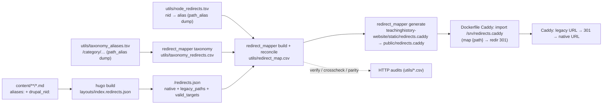

# Legacy URL Redirects (Drupal → Hugo → Caddy)

How teachinghistory.org's old Drupal URLs keep working after the Hugo migration.

- **Old site:** teachinghistory.org (still live on Drupal 10)
- **New site:** dev.teachinghistory.org (this Hugo repo, fronted by Caddy)

**Goal:** Hugo serves clean, native slug URLs; the **web server (Caddy) owns every 301
redirect** from an old Drupal URL to its new native URL. The redirect map is generated
**deterministically from the Hugo content itself** — no MySQL dump, PHP, or other LAMP
artifacts — and the pipeline is CMS-agnostic so it can be reused for other
Omeka/Drupal/WordPress → Hugo migrations.

---

## 1. The core idea: redirects are *derived*, not hand-maintained

There is **no hand-edited redirect list**. Every old→new mapping is *computed* by joining two
kinds of source against the manifest of what Hugo actually serves:

1. **The surviving page's own frontmatter** — `aliases:` (path-aliases) + `drupal_nid:`
   (synthesizes `/node/{nid}`). This is emitted into the manifest by the build.
2. **Committed dumps of Drupal's `path_alias` table** — `utils/node_redirects.tsv`
   (nid → alias, the authoritative source of every `/node/{id}`) and
   `utils/taxonomy_aliases.tsv` (Drupal's `/category/{vocab}/{slug}` facet URLs). These carry
   old URLs that frontmatter can't (nodes with no front-matter nid; taxonomy terms, which have
   no frontmatter at all).



Every legacy source is resolved to the page's **current** native URL via the manifest, so a
target automatically tracks any later URL move. A dump entry whose slug Hugo doesn't serve
(unpublished/removed node, pruned term) is **skipped**, never redirected to a 404.

**Two things remain a per-page responsibility.** When a page is merged, moved, or deleted,
its path-aliases must be carried onto the surviving page (see §6) — the `path_alias` dump only
supplies the *old* URL, and it resolves to a native only if some page still serves that slug.

---

## 2. Content model

- **`url:` → `aliases:` (data only).** The legacy Drupal path lives in `aliases:`; it is
  *not* used to serve the page. `disableAliases = true` (in `hugo.toml`) means Hugo writes
  **no** alias stub HTML — Caddy is the sole redirect authority.
- **Native URLs are clean slugs.** Content files are named `{slug}.md` (the `-{drupal_nid}`
  suffix is stripped), so `/history-content/website-reviews/statistics-in-schools/`, not
  `.../statistics-in-schools-25863/`.
- **`drupal_nid:` always stays** in frontmatter — for provenance and to synthesize the
  `/node/{nid}` redirect. Every page's legacy URL set = its `aliases:` (path-aliases) **plus**
  the synthesized `/node/{drupal_nid}` (Drupal serves both; e.g. `/node/24438` 301s to its
  alias on the live site).
- **`/node/{id}` is a UNION of frontmatter and the `path_alias` dump.** `build` also loads
  `utils/node_redirects.tsv` (nid → alias, dumped from Drupal's `path_alias` table) and joins
  each nid to its current native via the manifest. This decouples node coverage from
  frontmatter hygiene: a `/node/{id}` keeps redirecting even if a page loses its `drupal_nid`,
  and nodes with *no* front-matter nid are still covered as long as their alias is served. It
  is authoritative insurance, not a replacement — the frontmatter path still covers the ~11
  nodes Drupal served **only** at `/node/{id}` (no pretty alias, so no dump row). See §9.
- **Slug collisions** keep the `-{nid}` suffix (Hugo's native filename-based
  disambiguation). After the Beyond-the-Textbook merge and distinct-slug renames (§6),
  effectively **no** nid-suffixed URLs remain; the collision safety-net in
  `strip_nid_slugs.py` only re-engages if future content collides.

---

## 3. The tools (`utils/`, run with `uv`)

| Script / data | Purpose | Idempotent? |
|---|---|---|
| `relocate_urls.py` | `url:` → `aliases:` across all content | yes |
| `strip_nid_slugs.py` | drop `-{nid}` from filenames; keep on genuine collisions | yes |
| `finalize_btt_merge.py` | retire Beyond-the-Textbook Part-1 drafts, moving their redirects to the merged page | yes |
| `redirect_mapper.py` | `build` · `taxonomy` · `reconcile` · `generate` · `verify` · `crosscheck` · `parity` · `crawl` | n/a |
| `node_redirects.tsv` | **INPUT** (committed): Drupal `path_alias` dump, nid → alias — source of every `/node/{id}` | n/a |
| `taxonomy_aliases.tsv` | **INPUT** (committed): Drupal `path_alias` dump of `/category/{vocab}/{slug}` facet URLs | n/a |
| `taxonomy_term_overrides.csv` | **INPUT** (committed): aliasless `/taxonomy/term/{id}` → Hugo term, resolved by Drupal title | n/a |
| `taxonomy_redirects.csv` | **GENERATED** by `taxonomy`: facet + term URLs → Hugo term/section URL (merged by `reconcile`) | n/a |
| `curated_redirects.csv` | **INPUT** (committed): hand-authored old → new for renamed/moved pages no dump covers (merged by `reconcile`) | n/a |
| `layouts/index.redirects.json` | Hugo template that emits `/redirects.json` (the manifest) | n/a |

**Refreshing the `path_alias` dumps** (rare — only when Drupal node↔alias or term↔alias
assignments change). On the live Drupal host:

```bash
# node_redirects.tsv  (nid -> alias)
drush sql:query "SELECT alias, path FROM path_alias WHERE status=1 AND path LIKE '/node/%'" \
  | sed -E 's#^(/[^\t]+)\t/node/([0-9]+)$#\2\t\1#' | sort -n > utils/node_redirects.tsv
# taxonomy_aliases.tsv  (alias -> /taxonomy/term/{id})
drush sql:query "SELECT alias, path FROM path_alias WHERE status=1 AND path LIKE '/taxonomy/%'" \
  | sort > utils/taxonomy_aliases.tsv
# taxonomy_term_overrides.csv  (aliasless term-ids -> Hugo term, matched by title)
#   tid,name from Drupal; match name to a Hugo term slug; or seed from a top-pages export.
drush sql:query "SELECT tid, name FROM taxonomy_term_field_data WHERE default_langcode=1"
just redirects   # rejoin against the current Hugo manifest
```

Each script has a full docstring; run with `--help` (argparse) where applicable. All the
one-time content transforms default to a **dry run** and take `--apply`.

---

## 4. Running the pipeline (runbook)

```bash
# One-time content transforms (dry-run first without --apply)
uv run utils/relocate_urls.py --apply         # url: -> aliases:
uv run utils/strip_nid_slugs.py --apply       # drop -{nid} from filenames
uv run utils/finalize_btt_merge.py --apply    # retire BTT Part-1 drafts, keep their redirects

# Generate the map + Caddy snippet
just build                                    # Hugo emits public/redirects.json
uv run utils/redirect_mapper.py build         # manifest + node_redirects.tsv -> utils/redirect_map.csv
uv run utils/redirect_mapper.py taxonomy      # taxonomy_aliases.tsv + manifest -> utils/taxonomy_redirects.csv
uv run utils/redirect_mapper.py reconcile     # merge taxonomy_redirects.csv + old_urls.csv + parent-section fallback
uv run utils/redirect_mapper.py generate      # -> teachinghistory-website/static/redirects.caddy (Hugo copies to public/)

# Verify / audit (see §5)
uv run utils/redirect_mapper.py verify   --target http://localhost:8080
uv run utils/redirect_mapper.py parity   --old-site https://teachinghistory.org --target http://localhost:8080
```

Discoverable via `just` too: `just redirects` (= build + taxonomy + reconcile + generate), plus
`just redirects-verify`, `just redirects-crosscheck`, `just redirects-relocate`.

**No local Hugo? Regenerate against the deployed manifest.** Every subcommand accepts
`--manifest <url>`, and `dev.teachinghistory.org` already serves `/redirects.json`. So the
whole map can be rebuilt without a Hugo toolchain:

```bash
just redirects-remote        # build/taxonomy/reconcile/generate against dev.teachinghistory.org/redirects.json
```

This is a faithful proxy for what's **live**; for the committed artifact, prefer a real
`just build` in CI so the manifest reflects unmerged local content. Both produce identical
output when the deployed site and the checkout agree.

---

## 5. Verification & auditing

Three independent HTTP checks (all deterministic, `--resume`/`--limit` supported; reports
land in `utils/*.csv`, gitignored):

- **`verify --target <caddy>`** — for each redirect: old path returns **301** with
  `Location` = expected native, and the native returns **200**; flags loops.
- **`crosscheck --old-site <drupal>`** — QA oracle: for each nid **in the `path_alias` dump**,
  the live Drupal `/node/{nid}` 301s to the alias we recorded. Confirms the map matches the
  live source. *Sample of 300 (July 2026): 300/300 agree.*
- **`parity --old-site <drupal> --target <caddy>`** — for each redirect, confirms the
  legacy URL still resolves (200) on the **live old site** *and* its target resolves (200)
  on the **new site**. Verdicts: `ok` / `old_missing` / `new_missing` / `both_missing`.
- **Taxonomy targets** — every distinct target in `taxonomy_redirects.csv` is a page the Hugo
  manifest lists as served. *July 2026: all distinct targets → 200 on dev.teachinghistory.org.*
- **Top-traffic before/after** — the ~981 specific URLs from the analytics top-pages export
  (`/operator/notes/top-pages-teachinghistory.org.csv`), each tested on the live deployed dev
  site vs. the new map. *July 2026: 404s **520 → 154** (366 rescued, **0 regressions**). The 154
  residual are all correctly 404: ~89 malformed bot faceted-search junk, ~56 unpublished/removed
  nodes (no Hugo target), and a few pages already dead on the live Drupal source. The recoverable
  renamed pages are handled by `curated_redirects.csv`.*

---

## 6. Preserving redirects when pages merge / move

Because redirects are derived from the surviving page's frontmatter, a merge/move only
keeps its redirects if the retired page's old URLs are copied onto the survivor — **both**
its path-alias(es) **and** `/node/{its_nid}` — otherwise those URLs 404.

`finalize_btt_merge.py` implements this for the **Beyond-the-Textbook** section. BTT content
is authored as two nodes per topic — Part 1 (`beyond_the_textbook`, a short "What Textbooks
Say" intro) and Part 2 (`beyond_the_textbook_part_2`, the long historian essay). The merge
folds Part 1's content into Part 2 and marks Part 1 a draft; but a draft is excluded from the
build, so its old URLs would drop out of the manifest. The finalize step, per topic:

1. copies Part 1's `aliases:` **and** `/node/{part1_nid}` onto the (surviving) Part 2 page;
2. renames Part 2 to the clean slug;
3. deletes the Part 1 draft.

Result: both nids' old URLs 301 to the single merged page (e.g. `/…/23918`, `/…/23919`,
`/node/23918`, `/node/23919` → `/history-content/beyond-the-textbook/huey-long/`).

**The same principle applies to any future merge/move** — move the old URLs onto the
survivor's `aliases:`, then regenerate.

---

## 7. Caddy integration

`redirects.caddy` is a **snippet** (directives, not a full server), imported **inside a site
block**. It is generated into `teachinghistory-website/static/`, so Hugo publishes it to
`public/redirects.caddy` — that is what ships it in the build/release artifact, and it lands
at `/srv/redirects.caddy` in the container. In this repo the wiring is baked into
`teachinghistory-website/Dockerfile`:

```caddy
:80 {
	root * /srv
	encode gzip zstd
	import /srv/redirects.caddy          # map {path} {redirect_target} + redir 301
	rewrite /img/* /assets{uri}
	file_server
}
```

One side effect of shipping it inside `public/`: the snippet is also fetchable at
`/redirects.caddy`. That's harmless (it's derived from public URLs); add a matcher to 404 it
if you'd rather not serve it.

Generated snippet shape:

```caddy
map {path} {redirect_target} {
	default ""
	/node/24438  /teaching-materials/english-language-learners/summarizing-and-paraphrasing/
	/node/24438/ /teaching-materials/english-language-learners/summarizing-and-paraphrasing/
	# … one line per legacy key …
}
@hasRedirect expression `{redirect_target} != ""`
redir @hasRedirect {redirect_target} 301
```

Details the generator handles:
- **Directive order:** Caddy runs `map` early and `redir` before `rewrite`/`file_server`,
  so a matched legacy path 301s before `file_server` can 404.
- **Trailing slash:** both `/x` and `/x/` are emitted so either form redirects. (Native
  URLs' trailing-slash canonicalization is handled automatically by `file_server` — a 308 —
  and is *not* part of the map.)
- **Loop guard:** any key equal to its own target is dropped (e.g. `/about/staff/`).
- **Conflicts:** if two pages claim one old URL, the winner is chosen deterministically
  (matched > fallback, then fewer path segments, then lexicographic) and logged.

---

## 8. Taxonomy facet redirects (Drupal `/category/…` → Hugo terms)

Drupal browsed content by facet at two URL shapes: the pretty `/category/{vocab}/{slug}` (e.g.
`/category/tags/art-museums`, `/category/topic/politics`) **and** the canonical
`/taxonomy/term/{id}`. Hugo emits its taxonomies at `/tags|/topics|/time_periods|/evidence_types/{slug}/`.
Taxonomy terms carry **no frontmatter**, so these can't flow through the manifest — they are
sourced from the committed `path_alias` dump `utils/taxonomy_aliases.tsv` (+ an overrides file,
below) and resolved by the `taxonomy` subcommand into `utils/taxonomy_redirects.csv`, which
`reconcile` merges as `match_via=taxonomy`. Every target is a manifest-verified 200 page.

**How each `/category/{vocab}/{slug}` facet is resolved:**

1. **Exact term match** — normalize both the Drupal slug and every Hugo term slug to `[a-z0-9]`
   **with common stopwords dropped** (`of/the/to/…`), then match within the mapped Hugo taxonomy
   (`tags→tags`, `keywords→tags`, `topic→topics`, `time-periods→time_periods`,
   media/multimedia→`evidence_types`, …). The normalization bridges `science-tech` ↔
   `science--tech.`, `health-disease` ↔ `health--disease`, and the NCHS eras
   `emergence-modern-us-1890-1930` ↔ `emergence-of-modern-us-1890-1930`. ~2,700 land here.
2. **Vocabulary fallback** — when the term no longer exists in Hugo (Drupal had 7,499 tags; Hugo
   has ~2,900), or the whole vocabulary is gone (`keywords`, `section`, `us-states-and-territories`,
   `year`, …), redirect to the best **verified** landing page: the taxonomy index (`/tags/`,
   `/topics/`, …), a section (`/blog/`, `/history-content/`), the ELL / lesson-plan-review
   sections, or the grade-band quick-links pages for `grade-level`/`quicklinks`. No home → `/`.

**Canonical `/taxonomy/term/{id}` URLs** (heavy real traffic — the `/taxonomy/term/` analytics
bucket alone is ~69k views) get the **same target** as their term:
- **Aliased term-ids** — the dump row's `source` column gives `/taxonomy/term/{id}`; emit it →
  the alias's resolved target.
- **Aliasless term-ids** — some terms had **no** `/category` alias (Drupal served them only at
  `/taxonomy/term/{id}`), so they aren't in the dump. `utils/taxonomy_term_overrides.csv` resolves
  the high-traffic ones (mostly evidence-type / topic browse facets) by matching the live Drupal
  term **title** to a Hugo term. Rebuild with the drush query in §3, or from a top-pages export.

**Not emitted:** `/feed` (per-term RSS) variants — they get no measurable traffic and would
roughly double the map (see §10 on map size). This is a deliberate **"no old facet URL 404s"**
policy for real pages; the CSV's `notes` column marks every row `taxonomy exact` /
`taxonomy fallback (<reason>)` / `term-id` / `term-override`, so the fallbacks are auditable and
easy to prune if a plain 404 is later preferred for absent terms. Total: **~18.3k** redirects.

**Why generated, not curated (unlike a small facet map):** at ~9k distinct terms across ~18
Drupal vocabularies with no 1:1 Hugo correspondence, hand-curation is infeasible; the join +
normalization + verified-fallback table *is* the source of truth. Re-run `just redirects-taxonomy`
whenever the term set changes; `verify`/`parity` flag any target that stops resolving.

---

## 9. Collision analysis & known findings

- **Slug collisions (19 groups):** 17 were Beyond-the-Textbook Part 1/Part 2 pairs (merged,
  §6); 2 are genuinely distinct pages sharing a title — the two *Thomas Jefferson Papers*
  website reviews (→ `thomas-jefferson-papers` and `thomas-jefferson-papers-library-of-congress`)
  and the two *Maps…* blog posts (→ base slug and `…-part-2`).
- **`parity` `old_missing` (3):** the quick-links pages (`/elementary-quick-links/`,
  `/high-quick-links/`, `/middle-quick-links/`). Their Drupal **path-alias** was retired
  after the migration snapshot (404 on live Drupal), but the underlying nodes are alive at
  `/node/24283|24284|24285` — which we redirect correctly to the (200) new pages. The stale
  aliases also still redirect harmlessly. **No content is orphaned.**
- **Drafts:** ~19 `draft: true` pages are intentionally excluded from the build and thus
  from redirects (can't redirect to an unbuilt page).

---

## 10. Performance

Caddy's `map` directive is a **linear scan** (~18 ns/entry), evaluated on **every** request.
Adding the taxonomy layer grew the map from ~9k to **~45k keys** (`~22.7k` old URLs × both
slash variants), so a native request now full-scans ~45k entries:

| Path | Native-page overhead |
|---|---|
| No map (floor) | — |
| ~9k-key map, native request (full-scan miss) | +~130 µs |
| **~45k-key map, native request (full-scan miss)** | **+~0.8 ms** |
| Map gated out for native traffic | +~16 µs |

At ~0.8 ms this is still dwarfed by TLS/proxy/network on a real request, but it is no longer
negligible and it is paid on **every** native page view. The high-value optimization is now
worth doing: **gate the map** so native traffic skips the scan — but the gate must match *all*
legacy shapes (`/node/{id}`, `/taxonomy/term/{id}`, `/category/…` **and** the handful of
non-numeric legacy paths like `/privacy`, `/about/staff`), or those redirects silently break. A
robust gate is "path starts `/node/` **or** `/taxonomy/` **or** `/category/` **or** is in a
small tail-set" — regenerable from the map. (Dropping the 0-traffic `/feed` variants already
halved the map from ~82k to ~46k keys.) For 100k+ redirects, move the lookup off the request
path (nginx `map`, which compiles to a hash; a Caddy KV module; or edge/CDN rules).

---

## 11. CMS-agnostic reuse (seams)

`redirect_mapper.py` has three pluggable seams so the same pipeline serves other migrations:

- **map source** — `load_manifest()` reads the Hugo `/redirects.json` (local file **or** URL).
  Every migrated Hugo site emits the same shape; only the identity field name differs
  (`drupal_nid` vs `wp_post_id` vs `omeka_item_id`).
- **identity source** — `load_node_aliases()` reads the committed `path_alias` dump
  (id → alias). Swap the dump per CMS; `EXTRACTORS[cms]` documents the HTTP fallbacks
  (WordPress `?p=`/`postid-` shortlinks, Omeka `/items/show/{id}`) when the id isn't dumpable.
- **URL enumerator** — `crawl` parses the old site's `sitemap.xml` (recursing sitemap
  indexes); add per-CMS fallbacks as needed. *(teachinghistory.org has no XML sitemap, so its
  map is built from frontmatter + the `path_alias` dumps; `crawl` is a no-op here.)*

To apply to a new site: have its Hugo build emit the manifest, pick the identity extractor,
then `build → reconcile → generate → verify/parity`.

---

## 12. Deployment & operations

- **Docker:** two-stage build (`Dockerfile`) — Hugo builds `public/` (which now includes
  `redirects.caddy`, copied from `static/`), then a Caddy stage serves `/srv` and imports
  `/srv/redirects.caddy`. `.dockerignore` keeps the build context small.
- **CI/CD:** on push to `main`/`preview`, the `chnm/.github` reusable Hugo workflow builds
  Hugo (the `public/` release artifact then contains `redirects.caddy`) + `docker build`s the
  committed `static/redirects.caddy`. **The live-site crosscheck/parity
  never run in CI** — they hit the live Drupal site and are run manually before a cutover.
- **Staging on moby (remote Docker over SSH):**
  ```bash
  export DOCKER_HOST=ssh://moby         # ~/.ssh/config Host moby -> 10.112.113.191
  docker build -t teachinghistory:cc-redirects teachinghistory-website
  docker run -d --name th-redirects --restart unless-stopped -p 8090:80 teachinghistory:cc-redirects
  # verify from anywhere that can reach moby:
  uv run utils/redirect_mapper.py verify --target http://10.112.113.191:8090
  ```

### Committed vs generated

- **Committed:** content, `utils/*.py`, `utils/redirect_map.csv`, `utils/node_redirects.tsv`,
  `utils/taxonomy_aliases.tsv`, `utils/taxonomy_term_overrides.csv`, `utils/taxonomy_redirects.csv`,
  `utils/curated_redirects.csv`, `hugo.toml`,
  `layouts/index.redirects.json`, `teachinghistory-website/static/redirects.caddy`, `Dockerfile`,
  `.dockerignore`, `justfile`.
- **Gitignored (regenerated on demand):** `teachinghistory-website/public/` (incl.
  `redirects.json` and the copied `redirects.caddy`), `utils/redirect_verify.csv`, `utils/redirect_crosscheck.csv`,
  `utils/redirect_parity.csv`.
